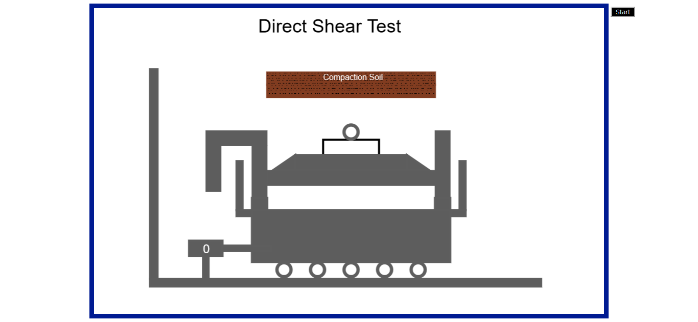
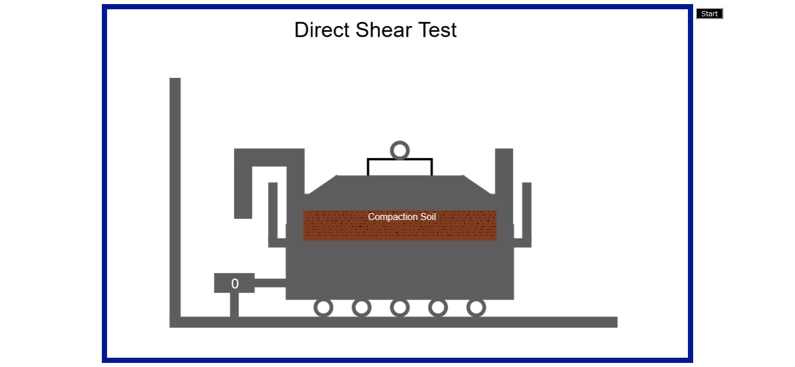
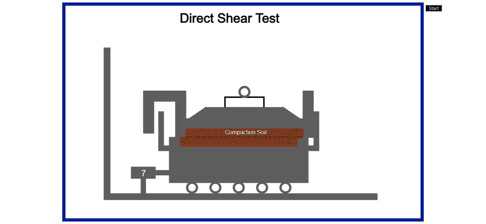
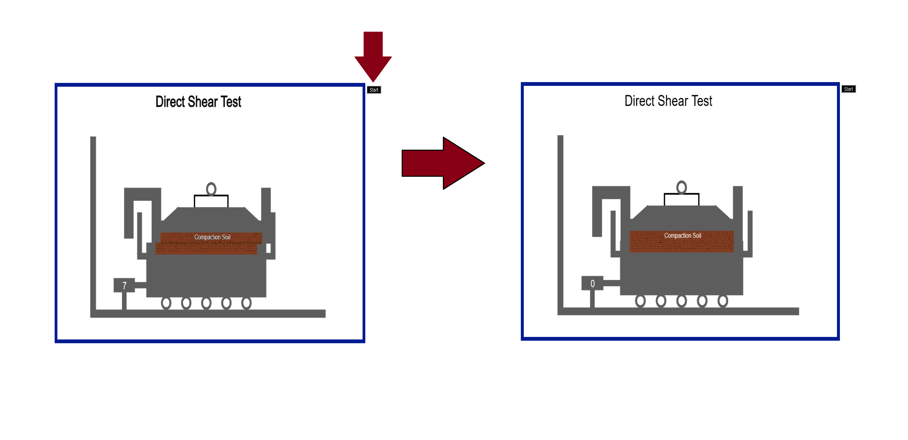

**Experiment Procedure Documentation**

**Introduction**

This document captures the instructions to run the simulation.

**Instructions**

1. To run the experiment, simply run the index.html file by clicking on it and the experiment will open in the browser.

2. To run the experiment of direct shear, click on **Start** button on top right corner.

3. Animation will start, demonstrating the shear strength of soil.

4. Click on **Start** button again to reset animation.

